# Sketch Solver Architecture

## Purpose

This document defines the production sketch platform that should replace the current
Gauss-Seidel style 2D sketch solver used by the browser app.

The target architecture is:

- Keep the current modeller sketch UI, snapping, tools, and overlays in JavaScript.
- Build a separate `sketch-toolkit` WASM target in this repository so sketch solver
  iteration does not trigger the slow OCCT rebuild path.
- Keep the authoritative sketch document, constraint graph, nonlinear solver, and
  solved-profile export inside that target and its TypeScript wrapper.
- Feed solved profiles and external-reference metadata into the OCCT feature layer only
  at the sketch-to-feature boundary.
- Preserve the current modeller interaction style: points, segments, circles, arcs,
  splines, dimensions, construction geometry, sketch planes, and sketch-on-face flow.
- Expose a narrow TypeScript subpath API from `occt-kernel-wasm/sketch-toolkit` so the
  browser app becomes a controller and renderer rather than the owner of solver state.

This is consistent with the current repository split:

- `modeller/js/cad/Solver.js` is an iterative local relaxer and should become a thin
  compatibility shim or fallback only.
- `modeller/js/cad/SketchFeature.js` currently solves in JS and exports plane plus
  profile loops. That responsibility should move into the new sketch toolkit target.
- `occt-kernel-wasm/src/types.ts` currently starts at solved `Profile` data. The new
  sketch subsystem must sit one layer above that and own the full sketch document.

## Binary Layout

The sketch solver should be implemented as an additional build target inside this
repository and package:

```text
occt-kernel-wasm/
  dist/
    occt-kernel.st.js
    occt-kernel.mt.js
    sketch-toolkit.wasm.js
  src/                    # OCCT-facing TypeScript wrapper
  src/sketch-*            # sketch toolkit TypeScript wrapper
  cpp/                    # OCCT kernel implementation
  cpp/sketch_toolkit.*    # sketch toolkit native core
  bindings/sketch_bindings.cpp
```

This gives three practical benefits:

1. sketch solver iteration stays fast and independent from the 2+ hour OCCT rebuild
   path
2. the modeller can consume the sketch toolkit through the same published package during
   migration
3. the OCCT target only needs a stable profile or sketch-export boundary, not a
   compile-time dependency on the nonlinear solver internals

## Design Principles

1. Persistent sketch data and runtime solver data are separate.
2. The global solver variable vector is built from canonical variable blocks, not from
   ad hoc per-constraint mutable objects.
3. Core constraints have analytical Jacobians.
4. General algebraic constraints and expression-backed constraints use automatic
   differentiation or a local finite-difference fallback.
5. External OCCT references are first-class zero-DOF entities with naming and
   invalidation metadata.
6. Temporary constraints never mutate persistent constraint state unless the user
   explicitly accepts an inferred permanent constraint.
7. Driving and driven dimensions are distinct objects in diagnostics, solving, and UI.
8. The default production solver path is trust-region least squares with rank-aware
   diagnostics, not sequential relaxation.
9. The kernel remains the source of truth for solved sketch geometry exported to OCCT.

## System Placement

```mermaid
flowchart LR
    A[modeller JS tools and renderer] --> B[TS sketch adapter]
  B --> C[sketch-toolkit API]
    C --> D[Sketch document]
    D --> E[Constraint graph and dependency graph]
    E --> F[Compiled solver system]
    F --> G[Nonlinear solvers]
    G --> H[Solved sketch geometry]
  H --> I[profile and reference export]
  I --> J[occt-kernel feature API]
  J --> K[Extrude/Revolve/Loft features]
  K --> L[OCAF and OCCT modelling state]
```



### Compatibility with the current modeller

The kernel sketch subsystem should mirror the current modeller semantics instead of
forcing a UI rewrite.

| Current modeller surface | Kernel-owned replacement |
| --- | --- |
| `Sketch` / `Scene` object graph | `SketchDocument` persistent model in the `sketch-toolkit` target |
| `Constraint.js` value formulas | `ExpressionGraph` + `ParameterTable` |
| `DimensionPrimitive.isConstraint` | `DrivingState::Driving` vs `DrivingState::Driven` |
| `SketchFeature.plane` | `SketchPlaneFrame` |
| `SketchFeature.extractProfiles()` | `sketch-toolkit.extractProfiles()` plus the OCCT wire build |
| `snap.js` and tool previews | temporary soft-constraint overlay |
| `Solver.js` / `assembly/solver.ts` | `SolverEngine` with LM, DogLeg, Newton, SQP, fallback GS |

## High-Level Architecture

Split the sketch system into five layers.

### 1. Persistent sketch model

Authoritative user data:

- entities
- constraints
- dimensions
- named parameters
- expressions
- external references
- sketch plane and local coordinate systems
- user metadata, visibility, construction flags, suppression, naming

This layer is versioned, serializable, and safe for undo/redo.

### 2. Compiled runtime model

Derived from the persistent sketch model:

- canonical solver variable blocks
- sparse residual row blocks
- curve evaluators
- witness variables for curve contacts
- connected solve groups
- scaling data
- cached Jacobian sparsity pattern
- cached symbolic factorization metadata

This layer is disposable and rebuilt incrementally when the sketch changes.

### 3. Solver engine

Implements:

- connected component solve splitting
- structural DOF analysis
- rank analysis
- nonlinear solve algorithms
- diagnostics extraction
- incremental drag solving
- driven-dimension evaluation

### 4. Export bridge layer

Converts solved sketch geometry into a stable handoff payload:

- exact 2D curve descriptors
- ordered wires and hole classification
- external-reference status
- edge and point provenance maps

This payload is consumed by the OCCT feature path in the same package.

### 5. OCCT export layer

Consumes solved sketch geometry and generates:

- exact 2D curve descriptors
- planar wires
- exact OCCT `Geom2d_*` or lifted `Geom_*` geometry
- profile wires with holes
- reference mapping back to sketch entity IDs for naming and diagnostics

## Geometry Model

### Persistent entity model

Every entity has:

- stable `EntityId`
- `EntityKind`
- `construction` flag
- `visible` flag
- `suppressed` flag
- `style` metadata
- `referenceMode` (`normal`, `construction`, `external`, `derived`)
- optional parameter references
- optional external reference binding

### Recommended entity parameterization

The sketch should use minimal intrinsic parameterizations where possible, but not at
the cost of losing stable authored points. Endpoints that users can select must remain
addressable even when the underlying entity uses a compact parameterization.

| Entity | Persistent representation | Solver DOF | Variable blocks in global vector |
| --- | --- | ---: | --- |
| Point | explicit point | 2 | `x`, `y` |
| Line segment | references two points | 0 intrinsic | inherited from endpoint points |
| Infinite construction line | anchor point + orientation | 3 | `anchor.x`, `anchor.y`, `theta` |
| Circle | center point + radius | 3 | `center.x`, `center.y`, `radius` |
| Arc | center point + radius + start angle + sweep | 5 | `center.x`, `center.y`, `radius`, `start`, `sweep` |
| Ellipse | center point + axes + orientation | 5 | `center.x`, `center.y`, `a`, `b`, `phi` |
| Elliptical arc | ellipse + start/end parameters | 7 | `center.x`, `center.y`, `a`, `b`, `phi`, `t0`, `t1` |
| B-spline / spline | authored control points, degree, knots, weights optional | `2*n` plus optional weights | `pole[i].x`, `pole[i].y`, optional `w[i]` |
| Polyline | ordered list of point refs | 0 intrinsic | inherited from vertex points |
| Coordinate system | origin point + orientation | 3 | `origin.x`, `origin.y`, `theta` |
| External vertex | projected point, read-only | 0 | none |
| External edge / curve | projected curve evaluator, read-only | 0 | none |
| External axis / plane ref | reference frame, read-only | 0 | none |

### Notes on representation

- Segments and polylines should reuse shared points exactly as the current modeller
  does. This preserves endpoint editing, coincident merging, and profile tracing.
- Infinite construction lines must not be represented as two distant points. That is
  numerically brittle and produces fake length DOF.
- Arcs should not be stored as center plus explicit start and end points because that
  introduces an unnecessary equal-radius hidden constraint. Keep a minimal arc state,
  but expose derived start/end points for selection and dimensions.
- Full circles and almost-full arcs must be distinguished. Any arc with
  `abs(2*pi - sweep) <= arcFullEps` should be promoted to a circle for solving and
  export.
- Elliptical arcs must use parameter values on the ellipse, not angle values in world
  space.
- Fit-point splines may exist in the UI, but the runtime solver should compile them to
  either explicit editable fit points with a hidden interpolation stage or to direct
  pole variables. Do not solve on regenerated hidden poles without a stable mapping.

### Derived geometric references

The solver must support stable derived references without adding persistent DOF.

- segment midpoint
- arc start point, end point, mid-parameter point
- ellipse major/minor axis endpoints
- spline endpoint, tangent handle, curvature sample
- polyline edge references

Derived references are selectable handles in the UI, but they do not allocate new
global variables.

### Coordinate systems and sketch planes

The 2D solve always happens in sketch-local coordinates.

- `SketchPlaneFrame` stores world origin, normal, x-axis, y-axis, units, and handedness.
- Local coordinate systems inside the sketch are construction/reference entities used
  for constraints, dimensions, and future feature placement.
- If the sketch plane itself is parameter-driven by the 3D model, that is handled by
  the model dependency graph outside the 2D solve. The 2D solve still sees a resolved
  local frame.

## Global Variable Vector

The compiled runtime model should flatten all editable scalar DOF into a single vector
`x` with a stable offset map.

```cpp
enum class SolverVarKind {
    PointX,
    PointY,
    Radius,
    Angle,
    Length,
    CurveParam,
    Weight,
    Scalar
};

struct SolverVariable {
    VariableId id;
    EntityId owner;
    SolverVarKind kind;
    uint32_t offset;
    double value;
    double scale;
    double lowerBound;
    double upperBound;
    bool fixed;
};
```

Rules:

- Use contiguous blocks per entity for cache locality.
- Use doubles everywhere in the solver, even in WASM builds.
- Keep persistent IDs separate from vector offsets. Offsets are runtime-only.
- Store variable scaling near the variable, not in a separate loosely-coupled map.
- Runtime-only witness variables use the same vector but live in an internal range that
  is never serialized.

## Constraint Framework

### Constraint object model

Each persistent constraint should compile to one or more residual rows.

```cpp
class Constraint {
public:
    ConstraintId id;
    ConstraintKind kind;
    DrivingState drivingState;
    ConstraintPriority priority;
    bool suppressed = false;
    virtual ~Constraint() = default;
};

class ConstraintEquation {
public:
    ConstraintId sourceConstraint;
    virtual void evaluate(const EvalContext& ctx, double* residual) const = 0;
    virtual void linearize(const EvalContext& ctx, JacobianAssembler& jac) const = 0;
    virtual void validate(const EvalContext& ctx, DiagnosticSink& sink) const = 0;
    virtual ~ConstraintEquation() = default;
};
```

### Residual conventions

- Length-like residuals are normalized by a local length scale `sL`.
- Angle residuals are wrapped to `[-pi, pi]` and left in radians.
- Coincidence-style vector residuals are 2-row residual blocks.
- Use signed residuals internally. Display absolute values in diagnostics when needed.
- Curve contact constraints should prefer witness parameters over pure distance-only
  formulations.

### Scaling conventions

For any constraint touching a local geometric neighborhood, compute:

- `sL = max(localCharacteristicLength, unitScale, 1e-9)`
- `sA = 1.0` for angle residuals in radians
- `sK = max(1.0 / sL, 1e-6)` for curvature residuals

`localCharacteristicLength` should be the maximum of:

- touched segment lengths
- touched radii or ellipse axes
- distance between involved points
- fallback `0.01 * sketchBoundingBoxDiagonal`

### Constraint catalog

#### Point and metric constraints

| Constraint | Residual equation | Jacobian structure | Scaling | Validity and degeneracy |
| --- | --- | --- | --- | --- |
| Coincident | `r = (p - q) / sL` | sparse `2 x 4` on point coordinates | length | always valid unless point refs missing |
| Distance point-point | `r = (||p-q|| - d) / sL` | sparse `1 x 4` using normalized direction | length | invalid when both points identical and target distance nonzero; use guarded derivative if `||p-q|| < eps` |
| Midpoint | `r = (p - 0.5*(a+b)) / sL` | sparse `2 x 6` | length | invalid if refs missing |
| Fix point | `r = (p - p0) / sL` | sparse `2 x 2` | length | trivial; do not model by marking point fixed only, keep explicit rows for diagnostics |
| Symmetry point-point about line | midpoint-on-axis plus direction orthogonal to axis | sparse on two points and axis vars | mixed length + angle | invalid if axis degenerate |
| Point-on-line | signed line distance `n dot (p-o) / sL` | sparse on point and line vars | length | invalid if line orientation undefined |
| Point-on-circle | `(||p-c|| - r) / sL` | sparse on point, center, radius | length | guard at `||p-c|| < eps`; if point equals center, initialize using previous witness direction |
| Point-on-arc | point-on-circle plus trim parameter check | point, center, radius, trim or witness parameter | length | invalid if sweep tiny or arc promoted to circle |
| Point-on-ellipse | `((x')/a)^2 + ((y')/b)^2 - 1` | sparse on point and ellipse vars | dimensionless | invalid if `a <= eps` or `b <= eps` |
| Point-on-curve | `p - C(t)` | sparse on point vars and witness `t`, curve vars | length | invalid if evaluator fails, `t` outside domain, or curve degenerate |

#### Orientation and line constraints

| Constraint | Residual equation | Jacobian structure | Scaling | Validity and degeneracy |
| --- | --- | --- | --- | --- |
| Horizontal | `(y2 - y1) / sL` | sparse on the two endpoint Y vars | length | invalid if segment collapsed to a point |
| Vertical | `(x2 - x1) / sL` | sparse on the two endpoint X vars | length | invalid if segment collapsed to a point |
| Parallel | `cross(u, v)` with normalized directions | sparse on the four endpoints or line vars | dimensionless | invalid for zero-length segments or undefined line direction |
| Perpendicular | `dot(u, v)` | sparse on the four endpoints or line vars | dimensionless | invalid for zero-length segments or undefined direction |
| Angle | `wrap(atan2(cross(u,v), dot(u,v)) - alpha)` | sparse on the two entities and optional parameter | radians | unstable near collapsed segments; switch to dot/cross pair if needed |
| Distance point-line | `(n dot (p-o) - d) / sL` | sparse on point and line vars | length | invalid if line undefined |
| Distance line-line | `(n dot (o2-o1) - d) / sL` with parallel prerequisite | sparse on both lines | length | invalid unless lines are parallel within tolerance; otherwise report unsupported dimension intent |

#### Circle, arc, and ellipse constraints

| Constraint | Residual equation | Jacobian structure | Scaling | Validity and degeneracy |
| --- | --- | --- | --- | --- |
| Radius | `(r - R) / sL` | sparse on radius variable | length | invalid if target <= 0 |
| Diameter | `(2*r - D) / sL` | sparse on radius variable | length | invalid if target <= 0 |
| Equal radius | `(r1 - r2) / sL` | sparse on the two radius vars | length | invalid if either entity is not radius-defined |
| Concentric | `(c1 - c2) / sL` | sparse `2 x 4` on centers | length | valid for circles, arcs, ellipses |
| Tangent line-circle | `(n dot (c-o) - sign*r) / sL` plus optional contact witness stabilization | sparse on line, center, radius | length | invalid if circle radius tiny or line undefined |
| Tangent circle-circle | `(||c2-c1|| - (sign1*r1 + sign2*r2)) / sL` | sparse on centers and radii | length | invalid if centers coincide or radii tiny |
| Equal length for arcs/circles | arc length or radius equality depending intent | sparse on radii and trim vars | length | keep explicit constraint subtype; do not overload segment equal-length silently |

#### Curve-to-curve constraints

| Constraint | Residual equation | Jacobian structure | Scaling | Validity and degeneracy |
| --- | --- | --- | --- | --- |
| Curve tangency | `C1(t1)-C2(t2)=0`, `cross(T1,T2)=0` | sparse on curve vars and witness `t1,t2` | length + dimensionless | invalid at cusps, inflections with zero tangent norm, or missing evaluators |
| Curve curvature continuity | coincidence + tangent + `(k1-k2)/sK = 0` | sparse on both curves and witness params | mixed | invalid where curvature undefined or tangent vanishes |
| Equal spline endpoint tangent | `T1 - lambda*T2 = 0` or angle-only variant | sparse on local poles and witness scale | dimensionless | invalid for clamped endpoints with zero derivative |

#### Dimensional, algebraic, and reference constraints

| Constraint | Residual equation | Jacobian structure | Scaling | Validity and degeneracy |
| --- | --- | --- | --- | --- |
| Driving dimension | wraps one of the geometric residuals above | same as underlying geometry residual | inherited | expression must evaluate, units must resolve |
| Driven dimension | no solve residual; evaluate after solve | none in main system | n/a | report stale or invalid source geometry separately |
| Algebraic expression constraint | `f(x, params) = 0` | sparse AD or finite-difference rows | user-defined, normalized by declared unit kind | invalid if parse, unit, or cycle failure |
| Named parameter reference | no residual by itself | parameter dependency only | n/a | lock state and cycles handled in dependency graph |
| External reference geometry | zero-DOF reference entity | no rows unless constrained against | n/a | invalid if topological naming fails or projection cannot be rebuilt |

### Conflicting, redundant, and underdefined handling

Do not treat this as a single boolean check.

- Underdefined: nullspace dimension after removing rigid-body modes is greater than zero.
- Fully defined: nullspace dimension is zero and all active driving constraints satisfy
  tolerance.
- Overdefined but consistent: at least one constraint row is rank-dependent while final
  residual floor remains within tolerance.
- Inconsistent: no feasible point satisfies the driving hard constraints within the hard
  tolerance band.

Handling strategy:

1. Structural pass marks obviously redundant or unsupported constraints.
2. Numerical pass uses scaled rank-revealing factorization of `J`.
3. If a new driving constraint is dependent but consistent, flag it redundant.
4. If a new driving constraint lifts the residual floor above tolerance, extract a small
   conflicting subset and offer demotion to driven.
5. Keep the newest user-added dimension as the default demotion candidate only when it
   is the least-destructive choice. Otherwise suggest a ranked list.

## Parametric References and Dependency Graph

### Supported reference sources

- named user parameters
- expressions
- other dimensions
- model-level parameters
- external geometry references
- projected OCCT edges, vertices, faces, axes, and planes

### Dependency graph model

Build a typed DAG with these node kinds:

- `ParameterNode`
- `ExpressionNode`
- `DimensionNode`
- `EntityNode`
- `ConstraintNode`
- `ExternalReferenceNode`
- `SketchNode`
- `FeatureNode`

Edge kinds:

- expression uses parameter
- dimension drives constraint
- entity depends on external reference
- sketch depends on plane or upstream feature
- downstream 3D feature depends on sketch output

### Requirements

- Use topological naming tokens, not transient OCCT indices, for external refs.
- Dirty propagation is edge-directed and reason-coded.
- Recompute ordering is topological unless a cycle is detected.
- Cycles are detected with Tarjan SCC or Kahn failure and reported with the exact node
  chain to the user.
- Units are carried on every parameter and expression result.
- Parameter locking is explicit. A locked parameter becomes a fixed scalar in the solve.
- External reference invalidation must distinguish:
  - naming failed
  - owning feature suppressed
  - projection failed
  - geometry changed but recovered to a close replacement

### External reference object

Each external reference should store:

- stable reference ID
- owning feature ID
- OCCT naming token or path
- subshape kind (`vertex`, `edge`, `face`, `axis`, `plane`)
- projection recipe into the sketch plane
- cached resolved local geometry
- last good fallback geometry
- status and recovery hints

When upstream model changes:

1. Re-resolve naming.
2. Reproject to the current sketch plane.
3. Rebuild dependent zero-DOF entities.
4. Mark dependent constraints dirty.
5. If naming fails but a geometric fallback can be matched within tolerance, attach a
   degraded but recoverable status instead of hard failure.

## Temporary Constraints

Temporary constraints are runtime-only residual blocks used during interaction.

Supported temporary constraints:

- mouse-driven drag anchors
- snap-to-grid
- snap-to-point
- snap-to-line
- horizontal or vertical inference
- tangency inference
- coincident preview
- alignment preview
- temporary fixed anchors
- soft constraints with weights
- temporary witness parameter freezing

### Rules for temporary constraints

1. Never serialize them into the sketch document.
2. Never create permanent constraint IDs for them.
3. They live in an `InteractionSolveSession` with its own residual block list.
4. They may introduce witness variables, but those are also runtime-only.
5. The persistent sketch state is updated only by the resulting geometry edit or by an
   explicit accepted inference.

### Recommended drag objective

For interactive solving use:

`min ||r_hard(x)||^2 + lambda_soft * ||W_soft * r_soft(x)||^2 + lambda_prox * ||x - x_prev||^2`

where:

- `r_hard` are permanent driving constraints
- `r_soft` are temporary interaction constraints
- `x_prev` is the pre-drag or previous-frame state
- `lambda_prox` stabilizes motion and reduces snapping jitter

This lets the drag system prefer permanent constraint satisfaction while still allowing
the cursor and inference layer to guide motion.

### Interaction flow

```text
beginDrag(entityHandle, pickedHandle)
  clone solved state into interaction state
  add drag anchor soft constraint
  add snap or inference preview constraints
  solve incrementally at pointer cadence
  show preview diagnostics

commitDrag()
  write final geometry deltas back to persistent entities
  optionally promote accepted inference to permanent constraint

cancelDrag()
  discard interaction state
```

## Driving and Non-Driving Constraints

Each constraint or dimension has a `DrivingState`.

- `Driving`: participates in the main solve as a hard residual or bound.
- `Driven`: excluded from the main solve; evaluated after the solve and displayed as a
  measurement.
- `Soft`: participates only in interaction or optimization contexts with finite weight.
- `Suppressed`: ignored except for history and UI.

### Rules

- Driven dimensions never allocate rows in the main residual vector.
- They are evaluated after geometry update using exact evaluators.
- Diagnostics still check whether a driven dimension references valid geometry.
- If adding a driving dimension makes the system inconsistent, the solver should be able
  to propose automatic demotion to driven for the newly added dimension or another
  low-priority redundant dimension.

### User-visible sketch states

- Underdefined: residuals small, nullspace dimension > 0.
- Fully defined: residuals small, nullspace dimension == 0.
- Overdefined: feasible but rank-deficient due to redundant driving constraints.
- Inconsistent: hard residual floor above tolerance.

## Solver Mathematics

### Core formulation

The default formulation is weighted nonlinear least squares on a scaled variable vector.

- `x_s = D_x^-1 * x`
- `r_s = W_r * r(x)`
- solve `min 0.5 * ||r_s||^2`

Where:

- `D_x` is diagonal variable scaling
- `W_r` is row scaling and hard/soft weighting
- bounds and inequality constraints are handled by SQP or trust-region subproblems when
  needed

### Jacobian and normal model

- `J = dr_s / dx_s`
- Gauss-Newton model: `m(p) = 0.5 * ||r + Jp||^2`
- LM model: `(J^T J + mu I) p = -J^T r`
- DogLeg combines steepest descent and Gauss-Newton steps inside a trust region

### Stopping criteria

Stop when all are satisfied or when failure is declared:

- `maxAbsScaledResidual <= 1e-8` for authoring solve, looser for drag
- `maxAbsScaledStep <= 1e-10`
- relative objective reduction below threshold for several iterations
- trust-region radius below minimum
- line-search step below minimum
- max iteration or max factorization count reached

### Recommended tolerances

Base these on model units and sketch size.

- `epsLen = max(1e-9, 1e-10 * sketchDiag, 0.1 * occtConfusion)`
- `epsAngle = 1e-10`
- `epsRank = 1e-9` after scaling
- `hardResidualTol = max(1e-8, 0.5 * occtConfusion / sL)`
- `dragResidualTol = 1e-5` scaled

`occtConfusion` should be a kernel-configured compatibility tolerance aligned with
OCCT `Precision::Confusion()` and feature-level tolerances.

## Algorithm Catalog

### Algorithm roles

| Algorithm | Use it when | Strengths | Weaknesses | Failure recovery |
| --- | --- | --- | --- | --- |
| Gauss-Seidel relaxation | small local edits, simple preview, emergency fallback | trivial, cheap, easy to warm-start | not globally robust, order-dependent, poor diagnostics | use for pre-relax, then switch to LM or DogLeg |
| Newton | square, well-conditioned, near a solution | quadratic convergence | unstable far from solution, needs good Jacobian and regularization | add line search or trust region, fall back to DogLeg |
| Gauss-Newton | overdetermined least-squares with small residual | fast with good Jacobian | weak under rank deficiency or strong nonlinearity | switch to LM if reduction stalls |
| Levenberg-Marquardt | default CAD sketch solve, especially mixed distance and tangency constraints | robust, handles poor starts better than GN | damping tuning required, slower than pure GN near solution | lower damping toward GN, switch to DogLeg when close |
| Trust-region DogLeg | medium-size well-scaled groups with good Jacobian sparsity | stable steps, good for interactive solve, efficient on repeated solves | assumes least-squares structure | if rejected repeatedly, switch to LM |
| BFGS | expression-heavy smooth objective without exact sparse Jacobian | simple Hessian approximation | weak for exact hard constraints and sparse structure | use only for soft optimization or rescue |
| L-BFGS | large soft-constraint drag systems or parameter fitting | memory efficient | not ideal for exact feasibility problems | switch to LM or SQP for hard constraints |
| SQP | bounds, inequality constraints, active-set trim limits, constrained optimization | best for mixed equalities and bounds | most complex, heavier per iteration | fall back to LM if active set oscillates |

### Recommended automatic selection

Use a policy, not a single default.

1. Build connected solve groups and inspect each group separately.
2. If the group has only linear or nearly linear constraints and a very good warm start,
   use line-search Newton or DogLeg.
3. If the group contains tangency, point-on-curve, spline continuity, or mixed soft
   interaction constraints, start with LM.
4. If the group uses bounds or active trim parameters, switch to SQP.
5. If Jacobians are incomplete and only soft interaction motion is required, allow
   limited L-BFGS fallback.
6. Always permit a short Gauss-Seidel pre-relaxation pass before the main nonlinear
   solver to improve the initial state.

### Failure switching policy

```text
GS pre-relax
  -> LM
  -> DogLeg if LM is near convergence and rank is acceptable
  -> line-search Newton if square and well-conditioned
  -> SQP if bounds/inequalities are active
  -> L-BFGS rescue only for soft interaction modes
  -> report failure with conflicting subset and free-direction diagnostics
```

## Recommended Solve Pipeline

```text
compile sketch document
  -> resolve parameters and external references
  -> build variable blocks
  -> build entity-constraint bipartite graph
  -> split connected solve groups
  -> structural DOF analysis
  -> redundancy pre-check
  -> add temporary constraints if in interaction mode
  -> assemble residual blocks and sparse Jacobian pattern
  -> apply variable and residual scaling
  -> choose algorithm per solve group
  -> solve each group
  -> validate residuals, rank, and bounds
  -> write solved values back to entities
  -> evaluate driven dimensions
  -> extract diagnostics and free directions
  -> regenerate OCCT wires and profiles if needed
```

### Group solve pseudocode

```cpp
SolverResult SolverEngine::solveGroup(CompiledGroup& group, const SolveOptions& options) {
    warmStart(group);
    preRelaxGaussSeidel(group, options.preRelaxIterations);

    auto algorithm = selectAlgorithm(group, options);
    auto result = runAlgorithm(group, algorithm, options);

    if (!result.converged && shouldRetryWithDifferentAlgorithm(group, result)) {
        algorithm = chooseRecoveryAlgorithm(group, result);
        result = runAlgorithm(group, algorithm, options);
    }

    analyzeRank(group, result);
    analyzeNullspace(group, result);
    extractConflicts(group, result);
    return result;
}
```

## Constraint Graph and DOF Analysis

### Graphs to maintain

1. Entity-constraint bipartite graph.
2. Variable-incidence graph.
3. Parameter-expression dependency graph.
4. External-reference dependency graph.

### Connected component detection

Use union-find or BFS on the entity-constraint graph restricted to active driving and
soft interaction constraints.

- Independent groups solve separately.
- This enables parallel solve groups later.
- Diagnostics remain group-scoped.

### Structural DOF analysis

For each group:

- sum intrinsic entity DOF
- subtract explicit fixed scalar vars
- subtract rigid-body modes when no absolute references exist
- subtract expected independent constraint equations

This is only a first estimate. Final status comes from numerical rank.

### Rigid cluster detection

Detect rigid clusters before numerical solve.

- points linked by fixed distances plus orientation locks
- segments tied by parallel/perpendicular plus length and coincidence constraints
- circle or arc centers with radius locks and concentric constraints

Rigid clusters help:

- improve DOF reporting
- choose drag handles
- reduce unnecessary variable motion during interaction

### Rank and nullspace analysis

After convergence or best-effort solve:

- compute rank of scaled `J` using sparse QR or SVD-like truncated analysis on each group
- nullspace basis vectors indicate free motion directions
- project nullspace onto picked handles during drag to determine allowed motion

### Conflict detection

Use a two-stage method:

1. Incremental addition with rank-revealing QR identifies suspicious rows.
2. Local hitting-set or deletion filtering extracts a small unsatisfied subset.

Diagnostics should never report only "solver failed" when a smaller conflicting set can
be isolated.

## Numerical Implementation Details

### Sparse matrix assembly

- Use compressed sparse row for assembled Jacobians.
- Keep a fixed sparsity pattern per compiled group when topology is unchanged.
- Reuse symbolic factorization across interactive frames.
- Assemble residual and Jacobian by row blocks because each constraint touches a tiny
  local neighborhood.

### Jacobian strategy

- Analytical Jacobians for core geometric constraints.
- Forward-mode AD for algebraic expressions and some curve constraints.
- Central finite differences only as a debug fallback or for rare plugin constraints.
- Keep derivative check infrastructure permanently available in tests.

Recommended implementation path:

- start with hand-written Jacobians
- add a tiny forward dual-number utility for local constraints
- optionally integrate a header-only AD library if code size remains acceptable

### Linear algebra recommendation

For WASM portability and code size:

- start with Eigen sparse data structures and sparse QR / LDLT backends
- keep the API abstract so native builds can later use SuiteSparse if needed

Do not lock the architecture to one factorization backend.

### Variable scaling

- point coordinates scaled by local length scale
- radii and lengths scaled by local length scale
- angles left in radians
- curve parameters scaled to `[0, 1]` where practical
- spline weights scaled around `1.0`

### Residual scaling

- each residual block provides its own nominal scale
- hard constraints are normalized to approximately unit magnitude at tolerance
- soft temporary constraints add user-level weights on top of nominal scaling

### Robustness rules

- Use guarded normalization for all direction vectors.
- Treat `length < epsLen` as degenerate and emit diagnostics before dividing.
- Wrap angle residuals with `atan2(sin(d), cos(d))`.
- Clamp curve parameters to domain bounds during line search or trust-region projection.
- Promote near-full arcs to circles and near-zero sweeps to invalid arcs.
- Reject ellipse axes `a <= epsLen` or `b <= epsLen`.
- For near-zero distances in tangent or point-on-circle constraints, use cached witness
  directions from the last valid state.
- Use proximal regularization for drag to avoid large nullspace jumps.

### Incremental solving during drag

- Reuse previous factorization when only residual values change.
- Rebuild sparsity only when topology or active constraint set changes.
- Cap per-frame iterations.
- Allow partial convergence with good preview rather than blocking the UI.
- Run long diagnostics asynchronously if needed; keep the interaction solve fast.

### Warm start

Warm-start everything:

- variable values from previous solve
- witness curve parameters
- trust-region radius
- LM damping estimate
- active-set guess for SQP

### Undo/redo safety

- persistent history stores user edits, not compiled solver state
- runtime caches are invalidated or reused safely after undo/redo
- never store raw vector offsets or witness variable IDs in history entries

## OCCT Integration

### Mapping solved sketch entities to OCCT

Use exact analytic geometry whenever possible.

- point -> `gp_Pnt2d`
- line segment -> `GCE2d_MakeSegment` or lifted 3D edge on sketch plane
- infinite line -> `Geom2d_Line` for reference only
- circle -> `Geom2d_Circle`
- arc -> `Geom2d_TrimmedCurve` on a circle basis
- ellipse -> `Geom2d_Ellipse`
- elliptical arc -> trimmed ellipse
- B-spline -> `Geom2d_BSplineCurve`

Construction geometry is excluded from profile generation but retained for references.

### Sketch plane representation

The existing `PlaneFrame` shape in `occt-kernel-wasm/src/types.ts` is correct as the
public representation.

Internally add:

- unit metadata
- handedness flag
- cached orthonormal frame
- transform to and from world coordinates

### Projection of OCCT topology into sketch space

External references should be projected into local sketch coordinates and cached as
reference entities.

- vertex -> fixed local point
- edge -> local analytic curve if planar-compatible, otherwise sampled or approximated
  reference curve with evaluator support
- planar face -> local outline and plane-alignment reference
- axis or datum line -> local infinite construction line
- datum plane -> sketch plane candidate or local coordinate-system reference

### Updating OCCT wires from solved sketch geometry

Replace the JS-side profile extraction as the authoritative source.

1. Build exact curve list from solved entities.
2. Resolve coincident endpoints under sketch tolerance.
3. Order into wires.
4. Classify outer and hole loops.
5. Create OCCT edges and wires.
6. Attach mapping from wire edges back to sketch entity IDs and sub-entity IDs.

### Building profiles from solved sketches

The kernel should expose:

- `extractProfiles()` for UI and diagnostics
- `buildProfileWires()` for exact feature input
- `exportSketchCurves()` for debug and testing

### Regeneration after upstream model changes

When upstream geometry changes:

1. re-resolve external references
2. dirty dependent entities and constraints
3. re-run solve for affected groups only
4. rebuild profile wires
5. notify downstream 3D features

### Tolerance compatibility with OCCT

Use a tolerance policy object shared by the sketch subsystem and the OCCT export layer.

- solve tolerance should usually be tighter than modeling tolerance
- endpoint merge tolerance should not exceed OCCT wire-building tolerance without an
  explicit reason
- avoid exporting tiny edges below OCCT healing thresholds; diagnose them instead

### Topological naming considerations

Sketch-to-model references must keep stable mapping data.

- store sketch entity ID to OCCT edge metadata when building features
- store upstream OCCT tokens for external refs
- preserve edge-order metadata through profile export so 3D features can map generated
  faces and edges back to sketch inputs

## C++ Class Design

The persistent layer should prioritize clarity and stable ownership. The runtime layer
should prioritize compact data access and explicit compilation.

```cpp
using SketchId = uint64_t;
using EntityId = uint64_t;
using ConstraintId = uint64_t;
using ParameterId = uint64_t;
using ExternalReferenceId = uint64_t;

struct SketchPlaneFrame {
    Vec3 origin;
    Vec3 normal;
    Vec3 xAxis;
    Vec3 yAxis;
    LengthUnit unit = LengthUnit::Model;
    bool rightHanded = true;
};

class SketchEntity {
public:
    EntityId id;
    EntityKind kind;
    bool construction = false;
    bool visible = true;
    bool suppressed = false;
    virtual ~SketchEntity() = default;
};

class Point2D final : public SketchEntity {
public:
    ScalarRef x;
    ScalarRef y;
};

class Line2D final : public SketchEntity {
public:
    EntityId p0;
    EntityId p1;
    bool infinite = false;
    std::optional<ScalarRef> theta;
};

class Circle2D final : public SketchEntity {
public:
    EntityId center;
    ScalarRef radius;
};

class Arc2D final : public SketchEntity {
public:
    EntityId center;
    ScalarRef radius;
    ScalarRef start;
    ScalarRef sweep;
};

class Ellipse2D final : public SketchEntity {
public:
    EntityId center;
    ScalarRef majorRadius;
    ScalarRef minorRadius;
    ScalarRef angle;
};

class Spline2D final : public SketchEntity {
public:
    uint32_t degree = 3;
    bool periodic = false;
    std::vector<EntityId> poles;
    std::vector<double> knots;
    std::vector<uint32_t> multiplicities;
    std::vector<ScalarRef> weights;
};

class Parameter {
public:
    ParameterId id;
    std::string name;
    UnitKind unit;
    bool locked = false;
    std::variant<double, ExpressionId> source;
};

class Expression {
public:
    ExpressionId id;
    std::string text;
    AstNodePtr ast;
    UnitKind unit;
};

class ExternalReference {
public:
    ExternalReferenceId id;
    ExternalReferenceKind kind;
    std::string ownerFeatureId;
    std::string namingToken;
    ReferenceStatus status;
    ResolvedReferenceGeometry cachedGeometry;
};

class Sketch {
public:
    SketchId id;
    std::string name;
    SketchPlaneFrame plane;
    std::vector<std::unique_ptr<SketchEntity>> entities;
    std::vector<std::unique_ptr<Constraint>> constraints;
    std::vector<Parameter> parameters;
    std::vector<Expression> expressions;
    std::vector<ExternalReference> externalReferences;
};
```

### Runtime classes

```cpp
class SolverSystem {
public:
    std::vector<SolverVariable> variables;
    std::vector<std::unique_ptr<ConstraintEquation>> equations;
    SparsePattern jacobianPattern;
    ConstraintGraph graph;
    ScaleModel scales;
};

class ConstraintGraph {
public:
    BipartiteGraph entityConstraint;
    DependencyGraph parameterDependency;
    std::vector<SolveGroup> groups;
};

class TemporaryConstraint {
public:
    TemporaryConstraintKind kind;
    double weight;
    bool hard = false;
};

class SolverResult {
public:
    bool converged = false;
    SolveStatus status = SolveStatus::Failed;
    uint32_t iterations = 0;
    double maxScaledResidual = 0.0;
    double objective = 0.0;
    DiagnosticReport diagnostics;
};

class DiagnosticReport {
public:
    SketchState sketchState = SketchState::Underdefined;
    std::vector<DiagnosticItem> items;
    std::vector<NullspaceDirection> freeDirections;
};
```

## API Design

### Public TypeScript-facing sketch API

The public API should stay narrow and mirror the current modeller workflow. This API
belongs to the `sketch-toolkit` subpath, not to the OCCT kernel root entry.

```ts
type SketchHandle = { id: number; sessionId: string };

interface SketchSolveOptions {
  mode?: 'authoring' | 'drag' | 'diagnostic';
  algorithm?: 'auto' | 'lm' | 'dogleg' | 'newton' | 'sqp' | 'gauss-seidel';
  maxIterations?: number;
  residualTolerance?: number;
  stepTolerance?: number;
  temporaryConstraints?: readonly TemporaryConstraintSpec[];
}

interface SketchSolveResult {
  converged: boolean;
  status: 'underdefined' | 'fully-defined' | 'overdefined' | 'inconsistent' | 'failed';
  iterations: number;
  maxScaledResidual: number;
  diagnostics: DiagnosticReport;
  drivenDimensions: readonly DrivenDimensionValue[];
}
```

Recommended methods:

- `createSketch({ plane, name, units })`
- `cloneSketch(sketch)`
- `disposeSketch(sketch)`
- `addPoint`, `addLine`, `addInfiniteLine`, `addCircle`, `addArc`, `addEllipse`,
  `addEllipticalArc`, `addSpline`, `addPolyline`
- `removeEntity`, `updateEntity`
- `addConstraint`, `removeConstraint`, `suppressConstraint`
- `addDimension`, `setDimensionDrivingState`, `editDimensionExpression`
- `setParameter`, `lockParameter`, `unlockParameter`
- `projectExternalReference`
- `solveSketch`
- `beginDrag`, `updateDrag`, `commitDrag`, `cancelDrag`
- `queryDegreesOfFreedom`
- `queryConstraintStatus`
- `getDrivenDimensions`
- `extractProfiles`
- `exportSolvedSketchToOcctProfile`

### OCCT integration boundary

The OCCT target should consume a stable sketch export boundary rather than owning the
solver implementation directly.

```cpp
class SketchExportBridge {
public:
  SketchExport importSolvedSketch(const SolvedSketchPayload&);
  OcctProfileSet buildProfiles(const SketchExport&) const;
  ShapeHandle buildWireSet(const SketchExport&) const;
};
```

## Diagnostics and User Feedback

Every diagnostic item should have:

- stable code
- severity
- user-facing message
- involved entity IDs
- involved constraint IDs
- suggested action

### Required diagnostics

- underdefined groups with explicit free directions
- fully defined confirmation
- overdefined but feasible constraints
- conflicting constraints with minimal subset
- failed solve with iteration and residual summary
- poor conditioning / scaling warnings
- degenerate geometry (zero-length segment, tiny radius, collapsed ellipse)
- external reference failure and attempted recovery state
- cyclic parameter dependency
- unsupported constraint intent (for example line-line distance on nonparallel lines)

### Example messages

- `Point P14 can still move along X. Add a horizontal position, coincidence, or lock.`
- `Distance D7 conflicts with Parallel C21 and Length C22.`
- `External edge reference R3 could not be resolved after upstream edit. Last valid
  projection is shown but the sketch is stale.`
- `Arc A5 is almost a full circle. Convert it to a circle or reduce the sweep.`

## Testing Strategy

### Unit tests

- every residual equation
- every analytical Jacobian
- parameter and expression evaluation
- external reference projection conversion
- profile extraction and loop classification

### Numerical verification

- compare analytical Jacobians against central differences
- rank and nullspace regression tests
- convergence tests across warm and cold starts

### Sketch regression corpus

Maintain a persistent corpus of representative sketches:

- simple rectangles with dimensions
- tangent line-arc-circle sketches
- symmetric mirrored sketches
- ellipse and elliptical arc sketches
- spline endpoint tangency sketches
- sketches with external projected edges
- overdefined sketches
- underdefined sketches
- inconsistent sketches
- mixed driven and driving dimensions

### Fuzzing

- randomized geometry generation
- randomized constraint subsets
- randomized parameter expressions
- randomized external reference invalidation events
- perturbation fuzzing around near-degenerate lengths and angles

### Interaction tests

- drag with soft anchors
- snap preview and inference promotion
- driven dimension update during drag
- free-direction projection during underdefined dragging

### Performance tests

Track at minimum:

- compile time from sketch document to solver system
- solve time by algorithm and group size
- drag frame solve time
- Jacobian assembly time
- factorization reuse hit rate
- OCCT wire export time

### Cross-checks against known CAD behavior

Where possible, compare against curated behavior from other CAD systems like FreeCAD Sketcher for:

- tangent solve stability
- line-line angle dimensions
- driven-vs-driving transitions
- underdefined free-direction hints
- overconstraint messages

## Implementation Roadmap

### Phase 1

- Refactor the current JS Gauss-Seidel solver behind a stable `ISketchSolver` interface.
- Introduce `SketchDocument`, `SolverVariable`, `ConstraintEquation`, and `SolverSystem`
  abstractions inside `occt-kernel-wasm`.
- Keep the browser UI in JS, but create a kernel-backed sketch session wrapper.
- Preserve the current modeller sketch tools and plane model.

### Phase 2

- Implement core constraints with analytical Jacobians:
  coincident, distance, horizontal, vertical, parallel, perpendicular, midpoint,
  radius, diameter, equal length, equal radius, concentric.
- Implement Gauss-Newton and Levenberg-Marquardt.
- Add derivative-check tests.

### Phase 3

- Add DogLeg trust-region solve.
- Add graph decomposition, connected components, and structural DOF analysis.
- Add numerical rank analysis and nullspace extraction.

### Phase 4

- Add temporary constraints and interaction solve sessions.
- Add drag anchors, snap constraints, and soft weights.
- Reuse symbolic factorization across drag frames.

### Phase 5

- Add driven and non-driving dimensions as first-class states.
- Add diagnostics for underdefined, overdefined, redundant, and conflicting states.
- Add auto-demotion suggestions from driving to driven.

### Phase 6

- Add BFGS and L-BFGS only for soft optimization or rescue modes.
- Add SQP for bounds, trim domains, and constrained subproblems.
- Do not make BFGS-family methods the default exact sketch solve path.

### Phase 7

- Add the parameter graph, unit-aware expressions, and model-level references.
- Add external OCCT references with naming recovery and stale-state diagnostics.
- Move authoritative profile extraction and OCCT wire generation into the kernel.

### Phase 8

- Harden with fuzzing, regression corpus, performance benchmarks, and UI diagnostics.
- Tune solver policies on large real-world sketch sets.
- Add telemetry hooks for solve time, failure mode, and conditioning in development builds.

## Edge Cases That Must Be Explicitly Handled

- zero-length segment
- coincident circle centers in tangent constraints
- tangent at a spline cusp or zero derivative point
- arc sweep near `0` or `2*pi`
- ellipse axis collapse (`a ~= 0` or `b ~= 0`)
- point-on-curve witness parameter at domain boundary
- nearly parallel line-line distance dimension on nonparallel lines
- multiple equivalent tangency solutions; choose nearest warm-start witness
- external reference deleted upstream
- mixed unit expressions (`mm + deg`) rejected at parse time
- parameter cycles
- stale driven dimension source after suppression or deletion
- huge coordinate magnitude causing poor conditioning

## Practical Recommendations

1. Make LM plus DogLeg the production default. Newton and SQP are specialized tools,
   not the starting point for every sketch.
2. Keep the persistent sketch API stable and UI-friendly, but compile to a numerical
   runtime model that looks nothing like the UI object graph.
3. Solve in doubles, keep exact analytic OCCT export, and never let display tessellation
   become the authoritative sketch geometry.
4. Treat point-on-curve and tangency constraints as witness-parameter problems. Trying to
   fake them with only local relaxations will not scale to professional CAD behavior.
5. Invest early in diagnostics and Jacobian tests. Production sketch solvers fail more
   often from poor diagnostics and silent derivative bugs than from missing algorithms.
6. Keep JS responsible for interaction choreography and rendering, but move authoritative
  sketch state, solving, and profile extraction into the `sketch-toolkit` target and
  keep the OCCT target focused on exact OCCT modelling.

